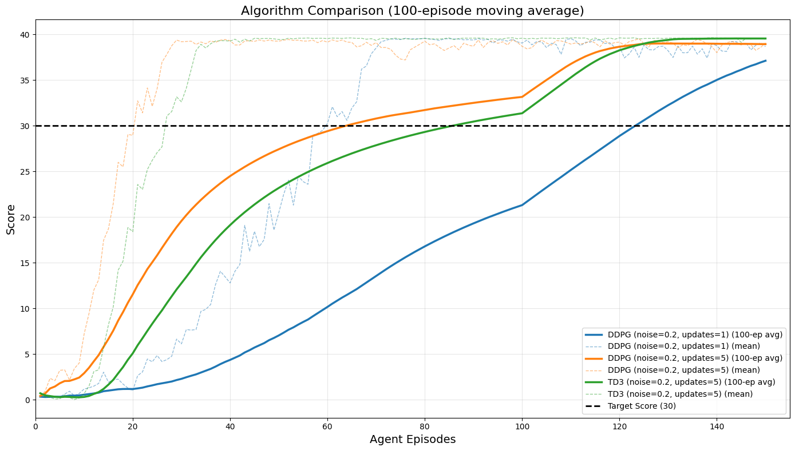
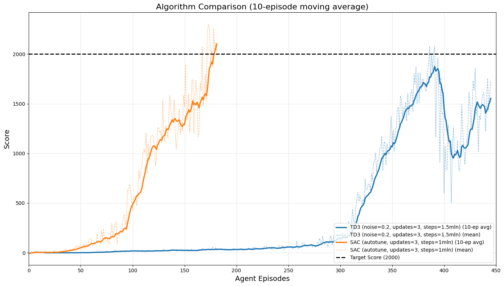

# Deep Reinforcement Learning Project: Continuous Control & Crawler

This repository contains my solutions for the Continuous Control (Reacher) and Crawler environments using state-of-the-art reinforcement learning algorithms.

## Project Overview

<!--   -->

<div style="display: flex; justify-content: space-between;">
  
  
</div>

This project implements and compares multiple deep reinforcement learning algorithms for solving challenging continuous control tasks:

- **Reacher Environment**: Control 20 double-jointed arms to reach target locations
- **Crawler Environment**: Teach 12 four-legged creatures to walk forward without falling

## Table of Contents

- [Project Overview](#project-overview)
- [Algorithms Implemented](#algorithms-implemented)
- [Results Summary](#results-summary)
- [Environment Setup](#environment-setup)
- [Running the Agents](#running-the-agents)
- [Project Structure](#project-structure)
- [Algorithm Details](#algorithm-details)
- [Results and Visualizations](#results-and-visualizations)

## Algorithms Implemented

- **DDPG (Deep Deterministic Policy Gradient)**: Off-policy algorithm combining DQN and policy gradient methods
- **TD3 (Twin Delayed DDPG)**: Enhanced policy gradient algorithm with double critics and delayed policy updates
- **SAC (Soft Actor-Critic)**: Maximum entropy reinforcement learning algorithm with automatic temperature tuning

## Results Summary

| Environment | Algorithm | Average Score | Training Steps | Agents |
| ----------- | --------- | ------------- | -------------- | ------ |
| Reacher     | TD3       | 39.48         | ~150k steps    | 20     |
| Reacher     | DDPG      | 39.12         | ~250k steps    | 20     |
| Crawler     | SAC       | 2113.45       | ~1M steps      | 12     |
| Crawler     | TD3       | 1800.00       | ~1.5M steps    | 12     |
| Crawler     | DDPG      | ~300 (breaks) | ~2M steps      | 12     |

### Environment Setup

#### Option 1: Using Conda (Recommended)

If you have [Anaconda](https://www.anaconda.com/download/) or [Miniconda](https://docs.conda.io/en/latest/miniconda.html) installed:

1. Clone this repository
2. Navigate to the repository directory
3. Create and activate the environment:

```bash
# Create environment from the provided environment.yaml
conda env create -f environment.yaml

# Activate the environment
conda activate control-reacher
```

#### Option 2: Using Pip

If you don't have Conda installed, you can use pip to install the required packages:

Install the required packages:

```bash
pip install -r requirements.txt

# Install the local Unity environment package:
pip install -e ./python
```

### Environment Installation

> **Version Note**: This project uses Unity ML-Agents version 0.4.0 (Udacity's Deep Reinforcement Learning Nanodegree environments). The implemented algorithms will work on newer ML-Agents versions with minor adjustments to the environment wrapper code.

#### 1. Download the Unity Environment

Choose the appropriate environment file for your operating system:

#### Reacher Environment:

> **Note**: This project uses the 20-agent version by default. Only use the single-agent version if you specifically want to train with one agent.

**Twenty Agents Version (Recommended):**

- [Linux](https://s3-us-west-1.amazonaws.com/udacity-drlnd/P2/Reacher/Reacher_Linux.zip)
- [Mac OSX](https://s3-us-west-1.amazonaws.com/udacity-drlnd/P2/Reacher/Reacher.app.zip)
- [Windows (64-bit)](https://s3-us-west-1.amazonaws.com/udacity-drlnd/P2/Reacher/Reacher_Windows_x86_64.zip)
- [Windows (32-bit)](https://s3-us-west-1.amazonaws.com/udacity-drlnd/P2/Reacher/Reacher_Windows_x86.zip)

**Single Agent Version:**

- [Linux](https://s3-us-west-1.amazonaws.com/udacity-drlnd/P2/Reacher/one_agent/Reacher_Linux.zip)
- [Mac OSX](https://s3-us-west-1.amazonaws.com/udacity-drlnd/P2/Reacher/one_agent/Reacher.app.zip)
- [Windows (64-bit)](https://s3-us-west-1.amazonaws.com/udacity-drlnd/P2/Reacher/one_agent/Reacher_Windows_x86_64.zip)
- [Windows (32-bit)](https://s3-us-west-1.amazonaws.com/udacity-drlnd/P2/Reacher/one_agent/Reacher_Windows_x86.zip)

#### Crawler Environment:

- [Linux](https://s3-us-west-1.amazonaws.com/udacity-drlnd/P2/Crawler/Crawler_Linux.zip)
- [Mac OSX](https://s3-us-west-1.amazonaws.com/udacity-drlnd/P2/Crawler/Crawler.app.zip)
- [Windows (64-bit)](https://s3-us-west-1.amazonaws.com/udacity-drlnd/P2/Crawler/Crawler_Windows_x86_64.zip)
- [Windows (32-bit)](https://s3-us-west-1.amazonaws.com/udacity-drlnd/P2/Crawler/Crawler_Windows_x86.zip)

1. Download the appropriate environment for your system and place it in the project directory.
2. Unzip (decompress) the file.

## Running the Agents

### Training New Agents

The training code is available in the following Jupyter notebooks:

#### Reacher Environment:

Open and run cells in `Continuous_Control.ipynb` notebook.

#### Crawler Environment:

Open and run cells in `Crawler.ipynb` notebook.

### Using Pre-trained Models

Both notebooks include sections for loading and visualizing pre-trained agent performance:

```bash
# Example from Crawler notebook
from rl_algo.sac_agent import Agent as SACAgent
from utils.recording import play_single_episode

sacAgent = SACAgent(state_size=state_size, action_size=action_size)
sacAgent.load('./models/sac_crawler_best.pth')

play_single_episode(sacAgent, env, brain_name=brain_name, max_steps=1000)
```

## Project Structure

```
├── assets/                    # Images and videos
├── models/                    # Saved model weights
├── data/                      # Training data and statistics
├── rl_algo/                   # Reinforcement learning algorithms
│   ├── td3_agent.py           # TD3 implementation
│   ├── sac_agent.py           # SAC implementation
│   └── sac_model.py           # Neural network architectures
├── utils/                     # Helper utilities
│   ├── plotting.py            # Visualization utilities
│   ├── recording.py           # Video recording utilities
│   ├── reacher_train.py       # Training utilities for Reacher
│   └── crawler_train.py       # Training utilities for Crawler
├── Continuous_Control.ipynb   # Notebook for Reacher environment
├── Crawler.ipynb              # Notebook for Crawler environment
└── train_crawler_sac.py       # Training script for Crawler SAC
```

## Algorithm Details

### TD3 (Twin Delayed DDPG)

TD3 addresses issues in DDPG with these improvements:

- Twin critics to reduce overestimation bias
- Delayed policy updates for stability
- Target policy smoothing to prevent exploitation of Q-function approximation errors

### SAC (Soft Actor-Critic)

SAC combines these features:

- Maximum entropy framework for exploration and robustness
- Actor-critic architecture with twin critics
- Automatic entropy temperature tuning
- Off-policy learning for sample efficiency

### DDPG (Deep Deterministic Policy Gradient)

DDPG provides a foundation for continuous control with:

- Actor-critic architecture with deterministic policy
- Experience replay buffer for sample efficiency
- Target networks with soft updates for stability
- Exploration through added action noise (Gaussian or Ornstein-Uhlenbeck)
- Off-policy learning combining DQN and policy gradient approaches

## Results and Visualizations

### Reacher Environment Performance



The graph above compares TD3 and DDPG performance on the Reacher environment with 20 agents. TD3 achieves higher scores more consistently than DDPG.

### Crawler Environment Performance



The comparison above shows performance of TD3 and SAC on the 12-agent Crawler environment. SAC demonstrates the best performance, followed by TD3. DDPG fails to solve the task, needs
more complex hyperparameters tuning.

## License

This project is licensed under the MIT License - see the [LICENSE](LICENSE) file for details.
