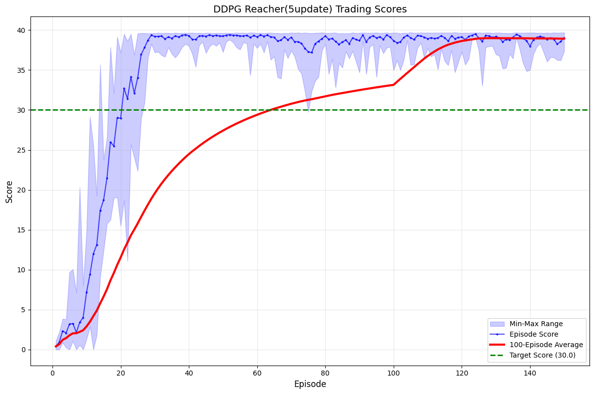
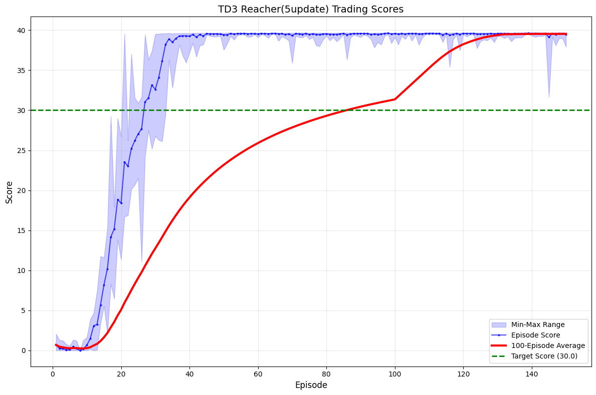
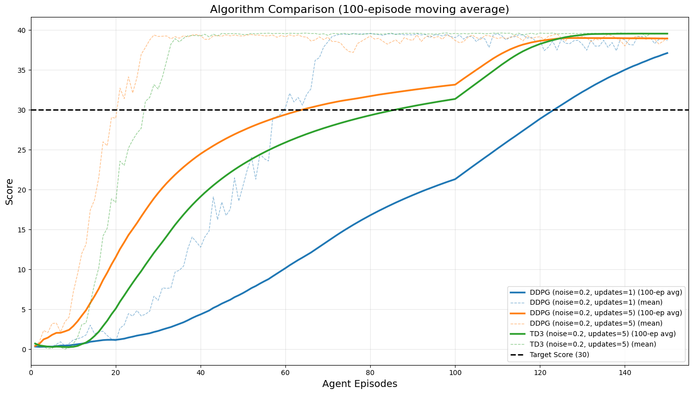
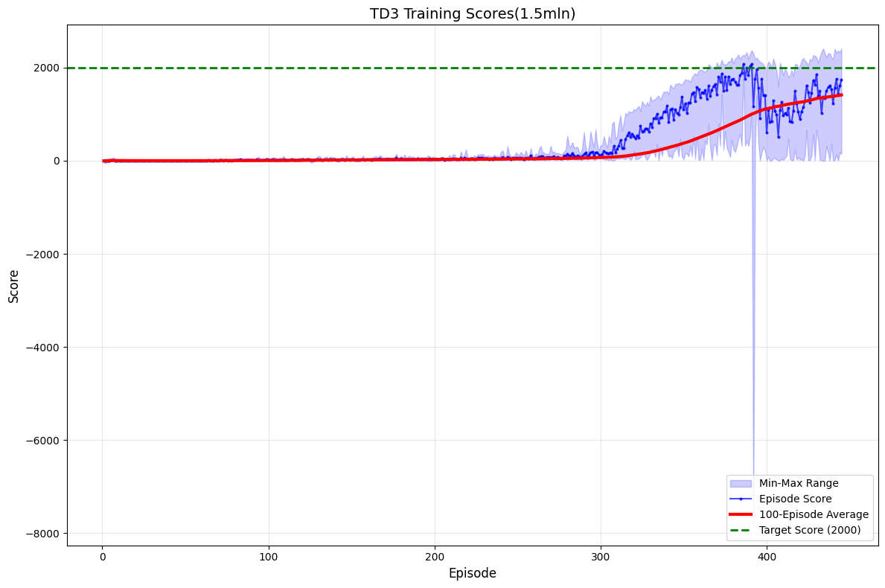
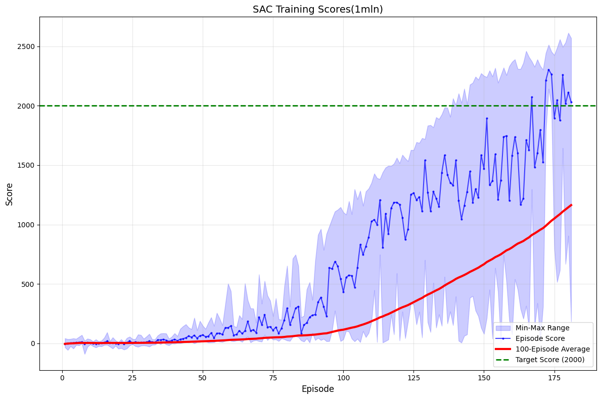
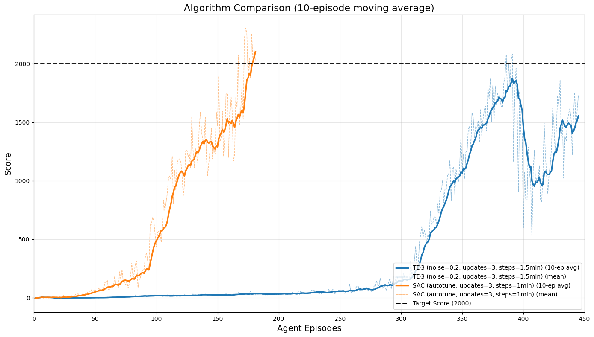

# Deep Reinforcement Learning Report

This report covers two continuous control environments: Reacher and Crawler. For Reacher the agent is trained with DDPG and TD3, and for Crawler two different algorithms (TD3 and SAC) are compared.

---

## 1. Reacher Environment (DDPG and TD3)

### Learning Algorithms

#### DDPG

- **Algorithm:** Deep Deterministic Policy Gradient (DDPG)
- **Key Elements:**
  - Actor-Critic architecture with local and target networks
  - Experience replay buffer for random sampling of past experiences
  - Gaussian Noise process for exploration
  - Soft updates for target networks

#### TD3

- **Algorithm:** Twin Delayed Deep Deterministic Policy Gradients (TD3)
- **Key Elements:**
  - Two critic networks to reduce overestimation bias
  - Delayed policy updates
  - Target policy smoothing
  - More stable learning than DDPG

### Hyperparameters

#### DDPG Hyperparameters

| Parameter    | Value | Description              |
| ------------ | ----- | ------------------------ |
| BUFFER_SIZE  | 1e6   | Replay buffer size       |
| BATCH_SIZE   | 256   | Mini-batch size          |
| GAMMA        | 0.99  | Discount factor          |
| TAU          | 1e-3  | Soft update parameter    |
| LR_ACTOR     | 1e-3  | Learning rate for actor  |
| LR_CRITIC    | 1e-3  | Learning rate for critic |
| UPDATE_EVERY | 1     | Updates frequency        |
| NUM_UPDATES  | 5     | Updates per update step  |

#### TD3 Hyperparameters

| Parameter           | Value | Description                           |
| ------------------- | ----- | ------------------------------------- |
| Exploration Noise   | 0.2   | Noise scale for exploration           |
| Target Policy Noise | 0.2   | Noise added to smoothen target policy |
| Target Noise Clip   | 0.5   | Clips target policy noise             |
| Actor LR            | 3e-4  | Learning rate for actor               |
| Critic LR           | 3e-4  | Learning rate for critic              |
| Skip Steps          | 1     | Environment steps between updates     |
| Update Times        | 5     | Number of updates per step            |
| Learning Starts     | 5000  | Steps before learning begins          |

### Model Architectures

- **DDPG Actor Network:**

  - Input: State size
  - Two hidden layers (400 and 300 units, LayerNorm, ReLU activations)
  - Output: Action space with tanh activation

- **DDPG Critic Network:**

  - Input: State size (with action injected after first hidden layer)
  - Two hidden layers (400 and 300 units, LayerNorm, ReLU activations)
  - Output: Single Q-value

- **TD3 Actor Network:**

  - Input: State size
  - Two hidden layers (256 and 256 units with ReLU activations)
  - Output: Action space with tanh activation

- **TD3 Critic Networks (Twin Critics):**
  - Input: State size and action (concatenated at input)
  - Two hidden layers (256 and 256 units with ReLU activations)
  - Output: Single Q-value (two separate critic networks)

### Plot of Rewards

The following plot shows the rewards per episode. In Reacher, the agent consistently reaches an average reward of at least +30 (averaged over 100 episodes, and over 20 agents if applicable).

_The environment was solved in 30 episodes with DDPG._

_The environment was solved in 30 episodes with TD3._

---

## 2. Crawler Environment (TD3 and SAC)

### Learning Algorithms

#### TD3

- **Algorithm:** Twin Delayed Deep Deterministic Policy Gradients (TD3)
- **Key Elements:**
  - Two critic networks to reduce overestimation bias
  - Delayed policy updates
  - Target policy smoothing
  - More stable learning in complex environments

#### SAC

- **Algorithm:** Soft Actor-Critic (SAC)
- **Key Elements:**
  - Stochastic policy with entropy maximization
  - Automatic temperature tuning for exploration-exploitation balance
  - Off-policy updates using a replay buffer
  - Highly sample-efficient learning

### Hyperparameters

#### TD3 Hyperparameters

| Parameter           | Value   | Description                           |
| ------------------- | ------- | ------------------------------------- |
| BUFFER_SIZE         | 1000000 | Replay buffer size                    |
| BATCH_SIZE          | 256     | Mini-batch size                       |
| GAMMA               | 0.99    | Discount factor                       |
| TAU                 | 0.005   | Soft update parameter                 |
| LR_ACTOR            | 0.0003  | Learning rate for actor               |
| LR_CRITIC           | 0.0003  | Learning rate for critic              |
| EXPLORATION_NOISE   | 0.2     | Noise scale for exploration           |
| TARGET_POLICY_NOISE | 0.2     | Noise added to smoothen target policy |
| TARGET_NOISE_CLIP   | 0.5     | Clips target policy noise             |
| POLICY_FREQUENCY    | 2       | Frequency of delayed policy updates   |
| SKIP_STEPS          | 1       | Environment steps between updates     |
| UPDATE_TIMES        | 3       | Number of updates per step            |
| LEARNING_STARTS     | 20000   | Steps before learning begins          |

#### SAC Hyperparameters

| Parameter       | Value   | Description                       |
| --------------- | ------- | --------------------------------- |
| BUFFER_SIZE     | 1000000 | Replay buffer size                |
| BATCH_SIZE      | 256     | Mini-batch size                   |
| GAMMA           | 0.99    | Discount factor                   |
| TAU             | 0.005   | Soft update parameter             |
| LR_ACTOR        | 0.0003  | Learning rate for actor           |
| LR_CRITIC       | 0.0003  | Learning rate for critic          |
| SKIP_STEPS      | 1       | Environment steps between updates |
| UPDATE_TIMES    | 3       | Number of updates per step        |
| LEARNING_STARTS | 20000   | Steps before learning begins      |

### Model Architectures

#### TD3 Architecture

- **Actor Network:**

  - Input: State size
  - Two hidden layers (256 and 256 units with ReLU activations)
  - Output: Action space with tanh activation to bound actions

- **Critic Networks (Twin Critics):**
  - Input: State size and action (concatenated)
  - Two hidden layers (256 and 256 units with ReLU activations)
  - Output: Single Q-value (two separate critic networks to reduce overestimation)

#### SAC Architecture

- **Actor Network (Policy):**
  - Input: State size
  - Two hidden layers (256 and 256 units with ReLU activations)
  - Output: Mean and log standard deviation of a Gaussian distribution over actions
  - Uses reparameterization trick for backpropagation through stochastic samples
- **Critic Networks (Twin Q-functions):**
  - Input: State size and action (concatenated)
  - Two hidden layers (256 and 256 units with ReLU activations)
  - Output: Q-values (two separate networks for ensemble learning)

Both algorithms use the same network sizes for fair comparison, with the key difference being SAC's stochastic policy representation that enables entropy maximization.

### Plot of Rewards

The rewards plots below show that both TD3 and SAC achieve an average reward ≥ +30 over 100 episodes.

_TD3 solved the environment in **380** episodes while SAC reached the target reward in **160** episodes. Also we notice TD3 has little collapse around episode **390**, possibly due to overfitting. DDPG was not able to solve the environment._

---

## 3. Ideas for Future Work

1. **Enhanced Stability for TD3:**  
   Address the observed performance collapse around episode 390 in the Crawler environment by implementing gradient clipping, adjusting the policy frequency, or modifying the target noise parameters.  
   _Note:_ This collapse may be due to the exploration noise (currently set to 0.2) being too high. Consider reducing it to improve stability.

2. **DDPG Improvements for Complex Tasks:**  
   Investigate why DDPG failed on the Crawler environment while succeeding on Reacher, potentially through modified noise processes or specialized network architectures for higher-dimensional action spaces.  
   _Note:_ I did add gradient clipping and it improved the situation, also reduced learning rate.

3. **Prioritized Experience Replay:**  
   Implement priority-based sampling to focus on the most informative transitions, potentially accelerating SAC's already impressive sample efficiency.

4. **Hyperparameter Sensitivity Analysis:**  
   Conduct a systematic study of how sensitive each algorithm is to its key parameters, focusing on the learning rates and update frequencies that showed significant impact in the current experiments.
